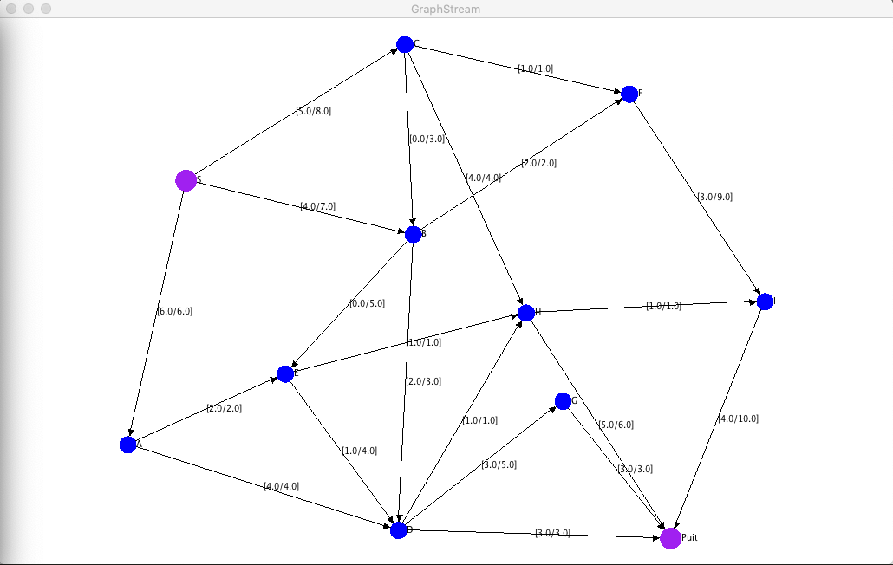
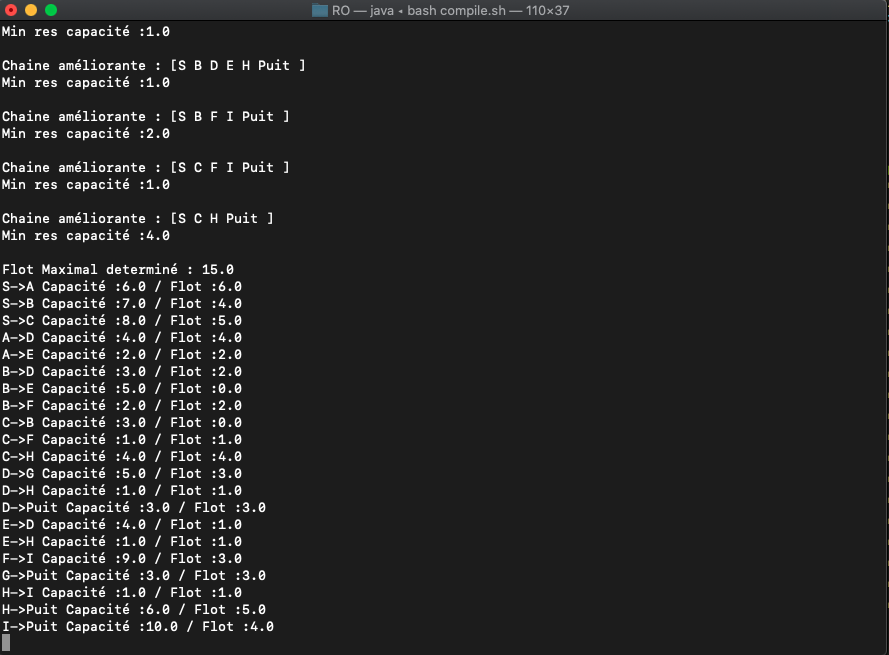

# __Max Flow Algorithm__

## Introduction
The goal of this project was to implement the Ford Fulkerson Algorithm to find the max flow path inside a graph.

## Visual

## Library
To visualize the results, we used the library GraphStream.
